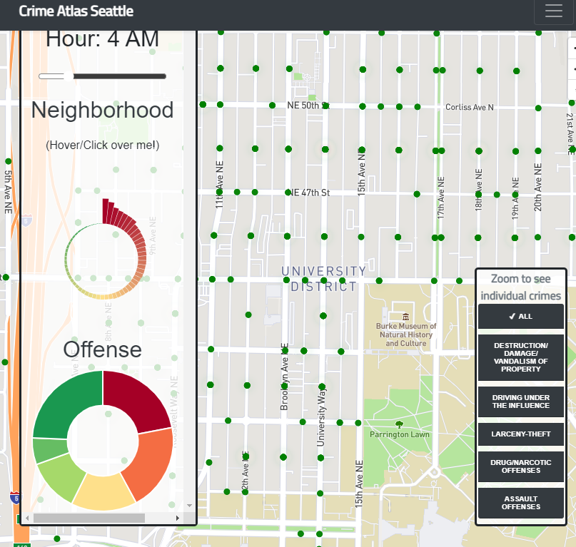

# Seattle Crime Atlas [![License][license-badge]][license]
https://ranv1r.github.io/crime-atlas-seattle/  

> A map showing the crime distribution in Seattle from 2008-present

A project by <b>Ranvir, Ziyang, Kiernan, and Andrew</b>

Figure 1. An overview of the project showing the heatmap across the city at a selected time.

## Summary
This project is a heatmap of crime around the city of Seattle. The project is based on public data from the Seattle Police Department that the city publicly offers.

## Background
The city of Seattle maintains an open data portal "for the purpose of increasing the quality of life [. . .]  increasing transparency, accountability and comparability.” Within this data portal, the Seattle Police Department (SPD) has frequently updates records of reported crimes since 2008, including information such as the type and location of the crimes. Using this data, we created a heat map of crime across the city.

The map shows a general geovisualized heatmap of crime across the city. A user can interact with it to filter by time and offence, as well as zoom in and out. Zooming in far enough swaps the heatmap for a point-by-point breakdown of crimes, their type, and their exact locations. The map also includes graphical breakdowns of the visualized areas to increase readability.

Figure 2. A demonstration of the behavior of the map upon zooming in.

## Project goals
With our project, we aim to present data on common crimes in the city of Seattle in an easy-to-read and comprehensible format. We recognize that there are some possible concerns of bias with this sort of visualization. However, we recognize that these concerns exist, and have attempted to create a map that is transparent and neutral, with clearly presented sources and without speculation. Interacting with our map, we hope that viewers such as policy makers, city staffers, and advocates can better understand crime in the city, and move or act accordingly.

## Features
The Map, which can be navigated using controls in the top-right, or with standard click-and-drag controls.
Graphs, located on the left side, which visualize a breakdown of crimes by type and by neighborhood, depending on a user-selected time. Mousing over these graphs will reveal additional information, including the type of crime, the neighborhood it was commited in, and a highligted boundard of the neighborhood.
Filters, located on the right side of the screen, which can be toggled to show or hide types of crimes.
Menu, located on the top-right. Interacting with this will display an about section, a short explination of how to use the controls, as well as link to the data sources used in the map.

## Process Breakdown
Our project was built iteratively, first by building a mockup in Figma. Here, we decided on features and their use in the final map. Next, we built out each individual component of the dashboard, generally completing a feature before moving on to keep from expanding the scope of the project too far, and worked to implement each part into the overall project. 

## Technologies
Our project uses [D3.js](d3js), [Mapbox.GL](https://docs.mapbox.com/mapbox-gl-js/api/), and [chart.js](https://www.chartjs.org/docs/latest/) to build our visualizations. Hosting and project management is provided via Github pages and Github VCS, respectively. 

## Data
We pulled our data from the [Seattle Open Data portal](https://data.seattle.gov/Public-Safety/SPD-Crime-Data-2008-Present/tazs-3rd5) which features entries about crimes since 2008, along with any details relevant to those crimes. More info on MCPP, the Seattle Police Department's neighborhood classification system, can be found [here](http://seattle.gov/police/information-and-data/mcpp-about).

### Acknowledgements
We would like to acknowledge the contributions that our teaching team have implemented for us to be able to have the framework and knowledge to be able to build this project, and the developers of all the other technologies of which we have dependencies. 

[license-badge]: https://img.shields.io/github/license/ajeetdsouza/zoxide?color=lightgray&style=flat-square
[license]: ./LICENSE.md
